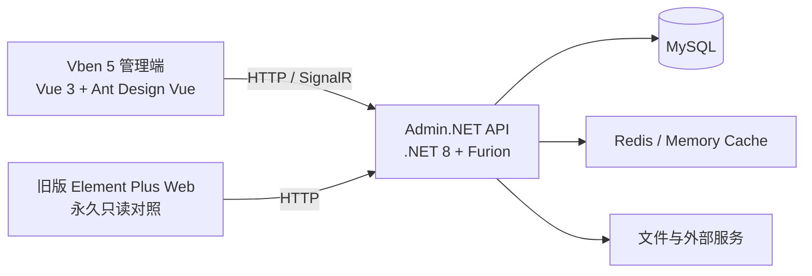

<div align="center">
  
  <h1>Admin.NET Vben</h1>
  <p>Admin.NET 后台的 Vben 5 + Ant Design Vue 社区翻新版本</p>

  [](https://dotnet.microsoft.com/)
  [](https://vuejs.org/)
  [](https://github.com/vbenjs/vue-vben-admin)
  [](https://antdv.com/)
  [](#开源与致谢)
</div>

## 项目介绍

本项目在 [Admin.NET](https://github.com/zuohuaijun/Admin.NET) 后端基础上，使用 [Vben Admin 5](https://github.com/vbenjs/vue-vben-admin) 的 `web-antd` 应用重建管理端 UI。

它不是简单更换颜色或组件库，而是重新适配了登录鉴权、动态菜单、按钮权限、多租户、请求协议和主要业务页面，并保留旧版 Element Plus Web 作为只读功能对照。

> 这是社区维护的迁移与翻新项目，不是 Admin.NET 官方发行版。

## 为什么做这个项目

- 使用 Vben 5 + Ant Design Vue 构建更清爽、高密度、适合长期操作的后台界面。
- 保留 Admin.NET 成熟的权限、多租户、字典、任务、日志、文件和代码生成能力。
- 通过独立适配层接入 Admin.NET，减少对核心后端的侵入。
- 为后续业务系统提供已经验收过的前后端二次开发基线。

## 技术架构



| 层级 | 主要技术 |
| --- | --- |
| 新版管理端 | Vue 3、Vben Admin 5.7、Ant Design Vue、TypeScript、Vite、Pinia |
| 后端 | .NET 8、Furion、SqlSugar、SignalR、Sundial |
| 数据与缓存 | MySQL、Redis 或内存缓存 |
| 权限模型 | 后端动态菜单、按钮权限、角色数据范围、多租户 |

## 已完成能力

### 系统与权限

- 登录、退出、Token 更新、401 恢复和首次重新登录跳转。
- 后端动态菜单、按钮权限、安全组件白名单和无权限首页回退。
- 账号、角色、机构、职位、个人中心、通知公告、三方账号和 AD 域配置。
- 多租户、注册方案、租户菜单授权、同步授权、切换租户和租管端。

### 平台能力

- 菜单、参数、字典、模板、任务调度、服务器监控和缓存管理。
- 行政区划、文件管理、打印模板、动态插件、开放接口和系统配置。
- 访问日志、操作日志、异常日志和差异日志。
- 审批流程、表单设计、库表管理、接口压测和 Vben 代码生成。

### 体验与安全

- 统一列表、搜索区、分页、弹窗、树形控件和操作按钮布局。
- 深色模式、紧凑布局、标签页、水印和国际化能力。
- 管理员接口权限边界、插件维护权限、登录公钥和敏感配置脱敏。
- 旧版 `Web` 永久只读，只运行和对照，不继续修改。

## 验收状态

当前版本已完成本地分层验收：

| 项目 | 结果 |
| --- | --- |
| Vben 单元测试 | 40 个测试文件、347 项测试通过 |
| 后端安全与工具测试 | 47 项通过 |
| 业务接口巡检 | 55/55 通过 |
| Vben 页面巡检 | 37/37 通过 |
| 核心写链路 | 租户、机构、角色、账号和权限 CRUD 通过 |
| 数据清理 | 测试残留、重复关系、孤儿关系均为 0 |

短信、邮件、LDAP、微信、MQTT、Office 和系统更新等能力需要专用外部测试环境。本项目已接入页面、接口和安全边界，但不会把未配置真实凭据的模块描述为已完成外部联调。

完整记录见 [全功能验收报告](./vben-web/docs/adminnet/full-functional-validation-2026-08-24.md)。

## 快速开始

### 环境要求

- .NET SDK 8
- Node.js 22
- pnpm 11
- MySQL 8
- 可选：Redis

### 1. 配置本地数据库

复制 `scripts/local-settings.example.ps1` 为 `.runtime-data/local-settings.ps1`，填写本机连接串。`.runtime-data` 已被 Git 忽略，请勿提交真实密码。

```powershell
$env:DbConnection__ConnectionConfigs__0__ConnectionString = `
  'Server=localhost;Port=3306;Database=AdminNET;Uid=root;Pwd=CHANGE_ME;SslMode=None;AllowPublicKeyRetrieval=True;'
```

### 2. 启动后端

```powershell
dotnet run --framework net8.0 `
  --project Admin.NET/Admin.NET.Web.Entry/Admin.NET.Web.Entry.csproj `
  --launch-profile Admin.NET.Web.Entry
```

后端默认地址：`http://localhost:5005`

### 3. 启动新版 Vben

```powershell
cd vben-web
pnpm install
pnpm dev
```

新版地址：`http://localhost:5666`

### Windows 本地一键启动

仓库根目录提供：

- `start-all.bat`：启动后端、旧版 Web 和新版 Vben。
- `stop-all.bat`：停止三个本地服务。

一键脚本使用 `vben-web/.runtime` 中的项目本地 Node。首次克隆的开发者可以使用系统 Node 22 按上面的标准命令启动，或自行准备同目录便携运行时。

## 项目目录

```text
Admin.NET/                         Admin.NET 后端
vben-web/apps/web-antd/            新版 Vben 管理端
vben-web/docs/adminnet/            迁移、使用、开发和部署文档
Web/                               旧版 Element Plus Web，只读对照
scripts/                           本地启动、停止和验收脚本
start-all.bat / stop-all.bat       Windows 一键运行入口
```

## 文档

- [功能与使用手册](./vben-web/docs/adminnet/function-and-user-guide.md)
- [二次开发指南](./vben-web/docs/adminnet/secondary-development-guide.md)
- [迁移执行记录](./vben-web/docs/adminnet/active-migration-plan.md)
- [安全整改记录](./vben-web/docs/adminnet/security-remediation-2026-08-24.md)
- [生产部署说明](./vben-web/docs/adminnet/production-deployment.md)

## 二次开发建议

1. 新业务只修改 Admin.NET 后端和 `vben-web`，不要修改旧版 `Web`。
2. 菜单、按钮和数据范围全部使用后端权限，不在前端写死管理员能力。
3. 新增业务可先用 Vben 代码生成预览 ZIP，评审后再写入项目。
4. 涉及租户、授权、文件、DDL 和代码生成时，使用隔离前缀测试并复核数据库副作用。
5. 外部服务使用专用测试账号，不连接生产环境做功能演示。

## 开源与致谢

本项目基于以下开源项目进行迁移与整合：

- [Admin.NET](https://github.com/zuohuaijun/Admin.NET)
- [Vben Admin](https://github.com/vbenjs/vue-vben-admin)
- [Ant Design Vue](https://github.com/vueComponent/ant-design-vue)
- [Furion](https://github.com/MonkSoul/Furion)
- [SqlSugar](https://github.com/DotNetNext/SqlSugar)

请同时遵守仓库中的 [MIT License](./LICENSE-MIT)、[Apache License 2.0](./LICENSE-APACHE) 以及各上游依赖的许可证和署名要求。

## 支持项目

觉得这个翻新方向有价值，可以点一个 Star。Issue 适合提交问题和需求，Pull Request 欢迎贡献页面适配、测试、文档与体验改进。

你的 Star 和真实使用反馈，会决定这个社区版本接下来优先完善什么。
